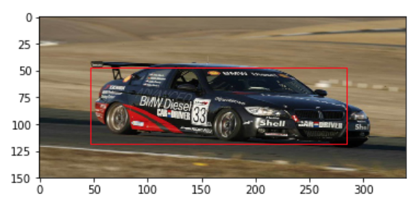

# TF fast rcnn
this repository goal is to train pascal VOC 2007 image , and detect car one of the Pascal VOC 2007 categories.

**Note**
this repository is not for reproduce the results in the [original paper](https://arxiv.org/abs/1504.08083)
if you want to reproduce results in original paper, please refer to [original code](https://github.com/rbgirshick/fast-rcnn)
purpose of this repository is to build fast-rcnn simplicity.
to get training images , we just crop images around GroundTruth instead of external Algorithm, *Selective Search* ,

# Faster rcnn Structure 

# result 

